R package eSIR: extended state-space SIR epidemiological models
================
[Song Lab](http://websites.umich.edu/~songlab/)
2021-10-31

**Notice**:

1.  We add new features in `tvt.eSIR()`. Now the new function
    `tvt.eSIR2()` adds `time_unit` which will allow users to change their
    time unit from 1 day to any arbitrary numbers of days.

2.  Since version 0.3.1, we added the US data. The most recent update
    was on June 25th, 2021. We used data summarized from [JHU CSSE
    GitHub](https://github.com/CSSEGISandData/COVID-19) and
    [1Point3Acres](https://coronavirus.1point3acres.com). Only 41 states
    have complete recovery data. We will update the data every Thursday
    or Friday evening. Using following codes for the data:

<!-- end list -->

``` r
data("confirmed") # From JHU CSSE
data("death") # From JHU CSSE
data("recovered") # partly from 1Point3Acres
data("USA_state_N") #population in each state
```

3.  Since version 0.3.3, we added Gelman-Rubin statistic for convergence
    check using
    [gelman.diag](https://www.rdocumentation.org/packages/coda/versions/0.19-3/topics/gelman.diag)
    from
    [`rjags`](https://CRAN.R-project.org/package=rjags).
    Their values substantially larger than 1 imply a failure of
    convergence of the MCMC chains. Save it in a `.txt` file by setting
    `save_files = TRUE` or retrieve it via following R code (assuming
    that `res` is object returned from `tvt.eSIR` or `qh.eSIR`):

<!-- end list -->

``` r
res$gelman_diag_list
```

Chinese
version:[中文](https://github.com/lilywang1988/eSIR/blob/master/README_cn.md)

## Purpose

The outbreak of novel Corona Virus disease (a.k.a. COVID-19), originated
in Wuhan, the capital of Hubei Province spreads quickly and affects many
cities in China as well as many countries in the world. The Chinese
government has enforced very stringent quarantine and inspection to
prevent the worsening spread of COVID-19. Although various forms of
forecast on the turning points of this epidemic within and outside Hubei
Province have been published in the media, none of the prediction models
has explicitly accounted for the time-varying quarantine protocols. We
extended the classical SIR model for infectious disease by incorporating
forms of medical isolation (in-home quarantine and hospitalization) in
the underlying infectious disease dynamic system. Using the state-space
model for both daily infected and hospitalized incidences and MCMC
algorithms, we assess the effectiveness of quarantine protocols for
confining COVID-19 spread in both Hubei Province and the other regions
of China. Both predicted turning points and their credible bands may be
obtained from the extended SIR under a given quarantine protocol. R
software packages are also made publicly available for interested users.

The standard SIR model has three components: susceptible, infected, and
removed (including the recovery and dead). In the following sections, we
will introduce the other extended state-space SIR models and their
implementation in the package. **The results provided below are based on
relatively short chains.** According to our experience, this setting
(`M=5e3` and `nburnin=2e3`) should provide acceptable results in terms
of the trend and turning points estimation, the estimation of parameters
and their credible intervals might not be accurate. Hence, if possible,
we would recommend using `M=5e5` and `nburnin=2e5` to obtain stable MCMC
chains via
[`rjags`](https://CRAN.R-project.org/package=rjags).


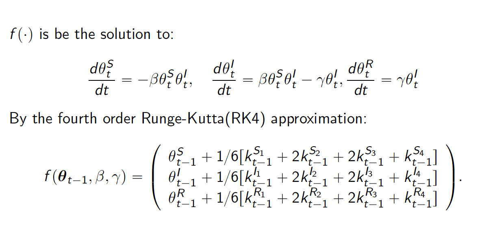


## Preparation

[Download packages
directly](https://github.com/lilywang1988/eSIR/tree/master/install_pkg)

To install and use this R package from Github, you will need to first
install the R package `devtools`. Please uncomment the codes to install
them. `eSIR` depends on three other packages, `rjags` (an interface to
the JAGS library), `chron` and `gtools`, which could be installed with
`eSIR` if not yet.

An error may occur if you have not yet installed JAGS-4.x.y.exe (for any
x \>= 0, y \>=0). **Windows** users may download and install JAGS from
[here](https://sourceforge.net/projects/mcmc-jags/files). **Mac**
users may follow steps at
[casallas/8411082](https://gist.github.com/casallas/8411082).

``` r
# install.packages("devtools")
# library(devtools)
# install_github("lilywang1988/eSIR")
library(eSIR) 
```

Our data are collected daily from
[dxy.com](https://mama.dxy.com/outbreak/daily-of-nationwide-new?index=20200206&locationIds=999&from=todh5).
Alternatively, we notice some convenient access to COVID-19 data from
[GuangchuangYu/nCov2019](https://github.com/GuangchuangYu/nCov2019).

For data outside China, we use [JHU CSSE
GitHub](https://github.com/CSSEGISandData/COVID-19) data. Another
package [coronavirus](https://github.com/RamiKrispin/coronavirus) has
its GitHub version udpated daily, which is also quite useful.

``` r
# Data of COVID-19 can be found in the following R packages: 
# install_github("GuangchuangYu/nCov2019")
#library(nCov2019) 
# install_github("qingyuanzhao/2019-nCov-Data")
#library(2019-nCov-Data) 
```

In Ubuntu (18.04) Linux, please first update R to a version \>= 3.6. You
may need to install jags package as well by `sudo apt-get install jags`
before install devtools by `install.packages("devtools")`.
[This](https://stackoverflow.com/questions/31114991/installation-of-package-devtools-had-non-zero-exit-status-on-ubuntu)
stackoverflow question perfectly solved the issue I encountered when
installing `devtools` on ubuntu. You may follow this
[gist](https://gist.github.com/lilywang1988/170fbf1bbea1a6c23bc43a0dc871a0ca)
to resolve other possible issues when installing `eSIR` on the recent
version of Ubuntu.

## Model 1 using `tvt.eSIR()`: a SIR model with a time-varying transmission rate

By introducing a time-dependent \[\pi(t)\in [0,1]\] function that
modifies the transmission rate \[\beta\], we can depict a series of
time-varying changes caused by either external variations like
government policies, protective measures and environment changes, or
internal variations like mutations and evolutions of the pathogen.

The function can be either stepwise or exponential:


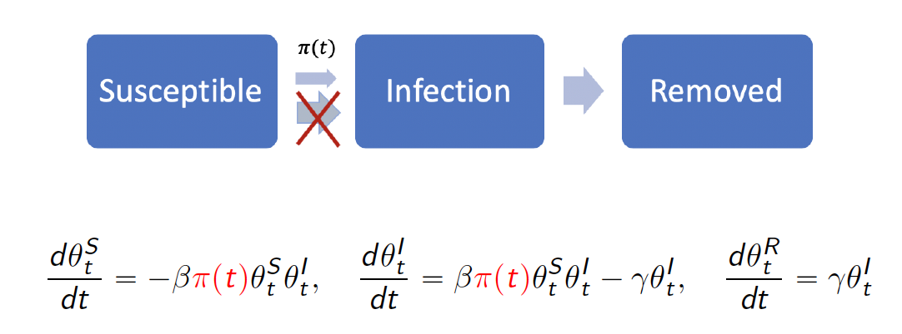

``` r
set.seed(20192020)
library(eSIR)
# Hubei province data Jan13 -> Feb 11
# Cumulative number of infected cases
NI_complete <- c(
  41, 41, 41, 45, 62, 131, 200, 270, 375, 444, 549, 729,
  1052, 1423, 2714, 3554, 4903, 5806, 7153, 9074, 11177,
  13522,16678,19665,22112,24953,27100,29631,31728,33366
  )
# Cumulative number of removed cases
RI_complete <- c(
  1, 1, 7, 10, 14, 20, 25, 31, 34, 45, 55, 71, 94,
  121, 152, 213, 252, 345, 417, 561, 650, 811, 
  1017, 1261, 1485, 1917, 2260, 2725, 3284, 3754
  )
N <- 58.5e6
R <- RI_complete / N
Y <- NI_complete / N - R #Jan13->Feb 11

### Step function of pi(t)
change_time <- c("01/23/2020", "02/04/2020", "02/08/2020")
pi0 <- c(1.0, 0.9, 0.5, 0.1)
res.step <- tvt.eSIR(Y, 
                     R, 
                     begin_str = "01/13/2020",
                     T_fin = 200,
                     pi0 = pi0, 
                     change_time = change_time, 
                     dic = FALSE, 
                     casename = "Hubei_step", 
                     save_files = FALSE, 
                     save_mcmc = FALSE,
                     save_plot_data = TRUE, # can plot them
                     M = 5e3, 
                     nburnin = 2e3 # additional to M
                     )
#> The follow-up is from 01/13/20 to 07/30/20 and the last observed date is 02/11/20.
#> Running for step-function pi(t)
#> Compiling model graph
#>    Resolving undeclared variables
#>    Allocating nodes
#> Graph information:
#>    Observed stochastic nodes: 60
#>    Unobserved stochastic nodes: 36
#>    Total graph size: 1875
#> 
#> Initializing model

res.step$plot_infection
```

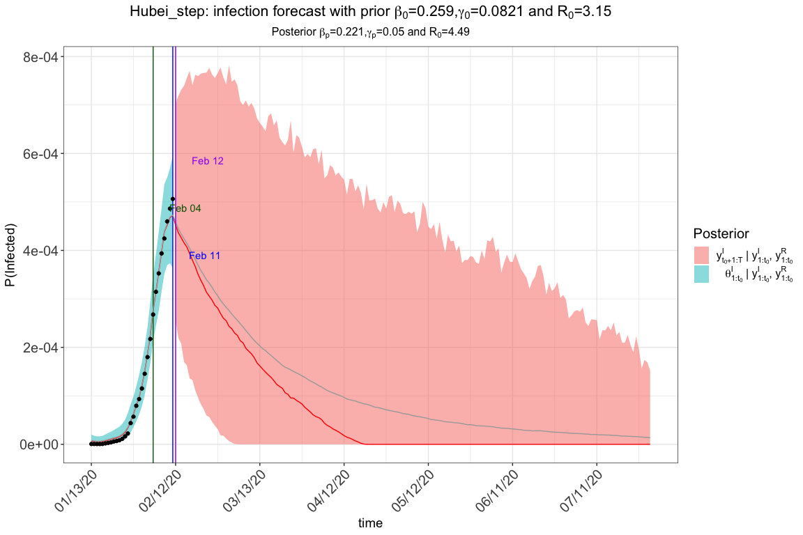<!-- -->

``` r
res.step$plot_removed
```

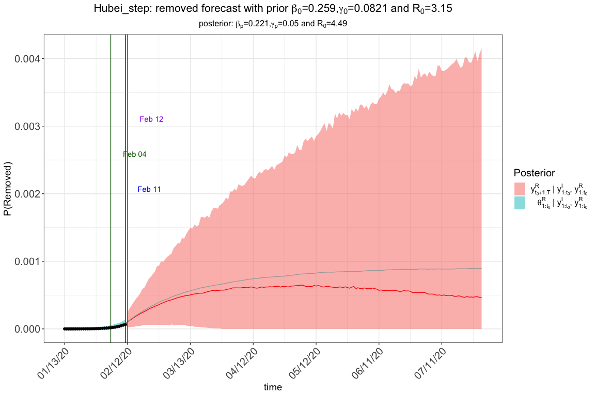<!-- -->

``` r
res.step$spaghetti_plot
```

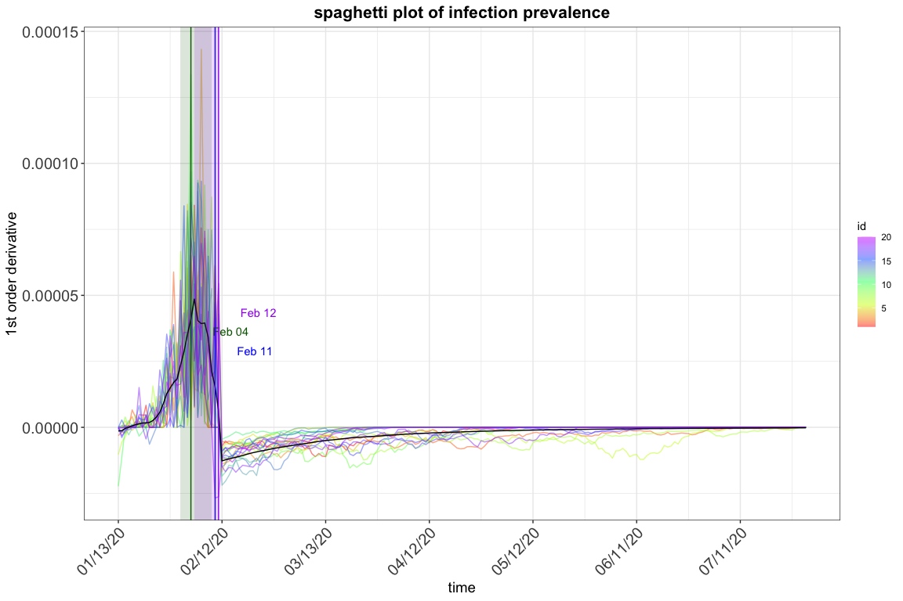<!-- -->

``` r


# If we change the time unit to 5 days
# Cumulative number of infected cases
NI_complete2 <- NI_complete[seq(1, length(NI_complete), 5)]
# Cumulative number of removed cases
RI_complete2 <- RI_complete[seq(1, length(RI_complete), 5)]
N2 <- 58.5e6
R2 <- RI_complete2 / N2
Y2 <- NI_complete2 / N2 - R2 #Jan13->Feb 11
change_time2 <- c("01/23/2020", "02/04/2020", "02/08/2020")
pi02 <- c(1.0, 0.9, 0.5, 0.1)
res.step2 <- tvt.eSIR2(Y2,
                       R2,
                       begin_str = "01/13/2020",
                       T_fin = 40,
                       pi0 = pi02,
                       change_time = change_time,
                       dic = FALSE,
                       casename = "Hubei_step2",
                       save_files = FALSE,
                       save_mcmc = FALSE,
                       save_plot_data = TRUE,
                       M = 5e3, 
                       nburnin = 2e3, 
                       time_unit = 5 #new feature!
                     )
#> The follow-up is from 01/13/20 to 07/26/20 and the last observed date is 02/07/20.
#> Running for step-function pi(t)
#> Compiling model graph
#>    Resolving undeclared variables
#>    Allocating nodes
#> Graph information:
#>    Observed stochastic nodes: 12
#>    Unobserved stochastic nodes: 12
#>    Total graph size: 395
#> 
#> Initializing model

res.step2$plot_infection
```

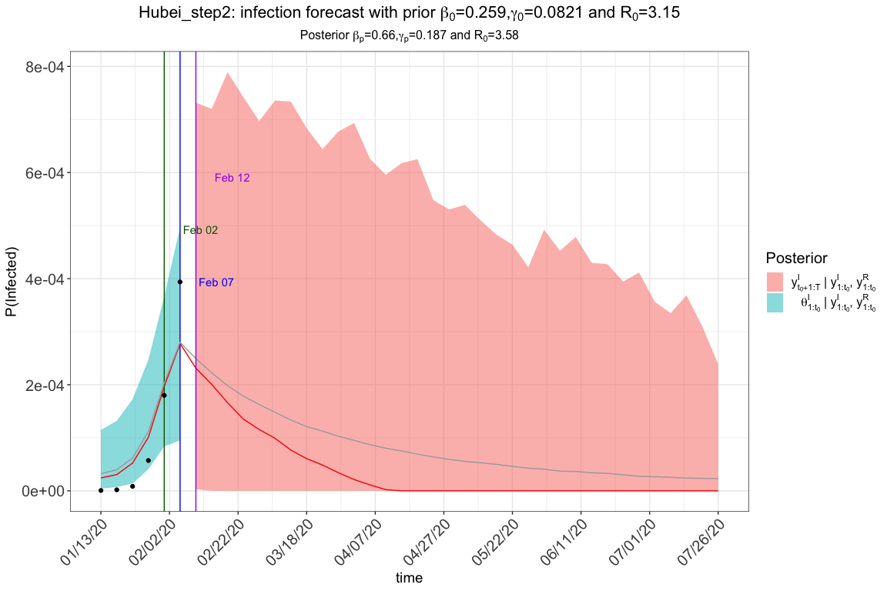<!-- -->

``` r
res.step2$plot_removed
```

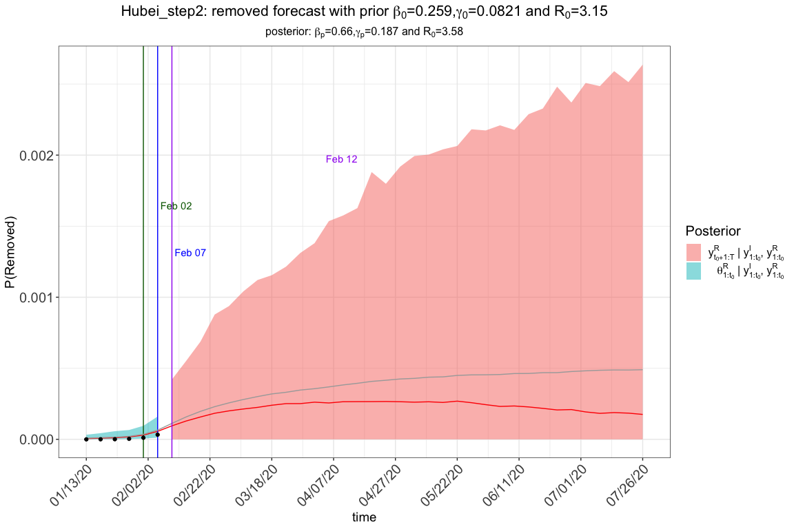<!-- -->

``` r
res.step2$spaghetti_plot
```

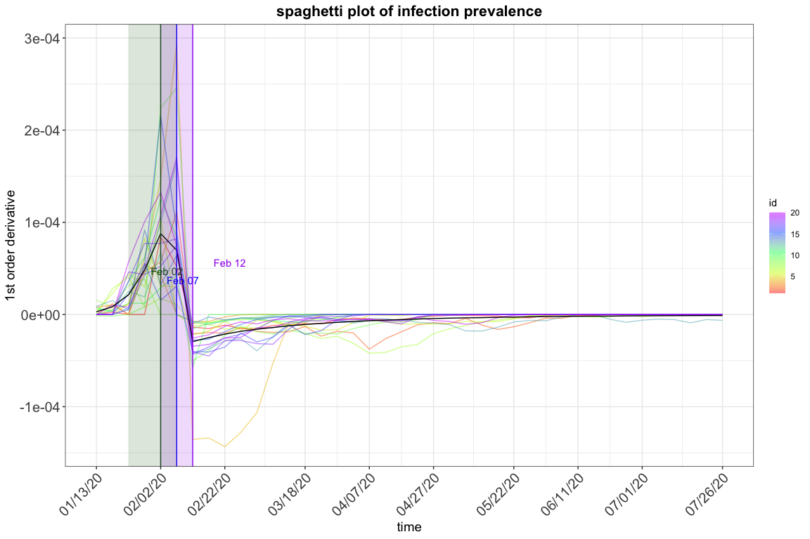<!-- -->

``` r
res.step2$dic_val
#> NULL
#res.step$gelman_diag_list
### continuous exponential function of pi(t)
res.exp <- tvt.eSIR(Y, 
                    R,
                    begin_str = "01/13/2020", 
                    death_in_R = 0.4,
                    T_fin = 200, 
                    exponential = TRUE, 
                    dic = FALSE, 
                    lambda0 = 0.05,
                    casename = "Hubei_exp", 
                    save_files = FALSE, 
                    save_mcmc = FALSE,
                    save_plot_data = TRUE,
                    M = 5e3,
                    nburnin = 2e3)
#> The follow-up is from 01/13/20 to 07/30/20 and the last observed date is 02/11/20.
#> Running for exponential-function pi(t)
#> Compiling model graph
#>    Resolving undeclared variables
#>    Allocating nodes
#> Graph information:
#>    Observed stochastic nodes: 60
#>    Unobserved stochastic nodes: 36
#>    Total graph size: 1875
#> 
#> Initializing model
  
res.exp$plot_infection
```

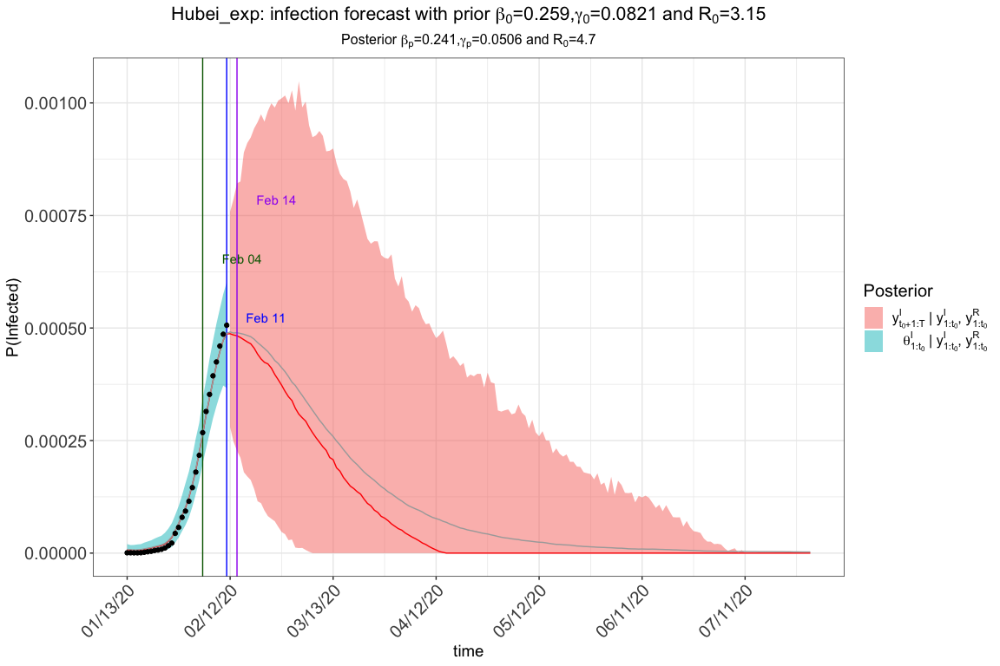<!-- -->

``` r
res.exp$spaghetti_plot
```

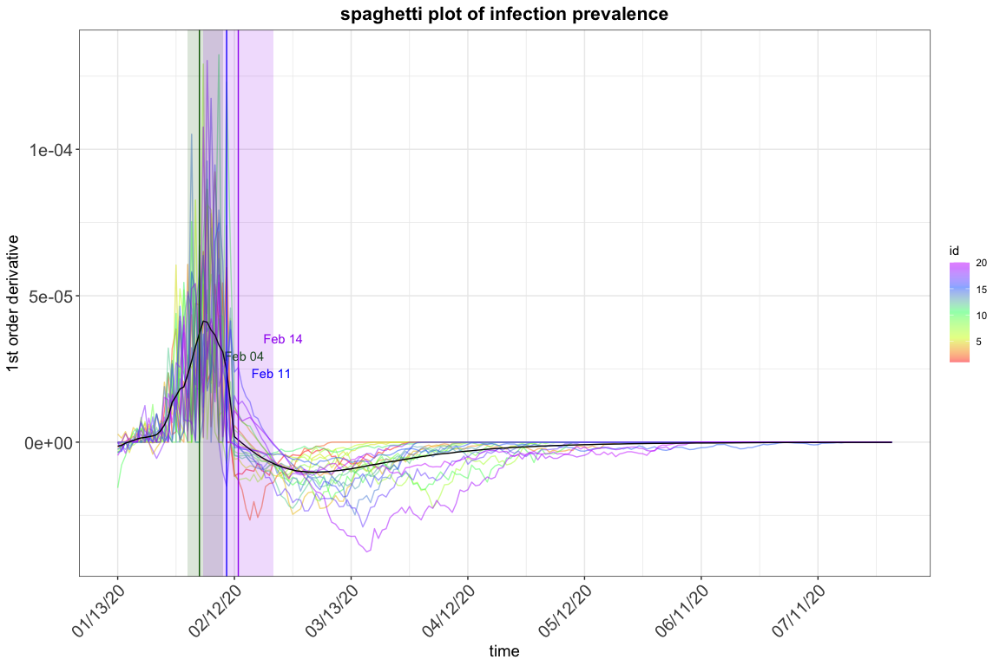<!-- -->

``` r
#res.exp$plot_removed

# Again, if we change our time unit to 5 days
res.exp2 <- tvt.eSIR2(Y2,
                      R2,
                      begin_str = "01/13/2020", 
                      death_in_R = 0.4,
                      T_fin = 200, 
                      exponential = TRUE, 
                      dic=FALSE,
                      lambda0 = 0.05,
                      casename = "Hubei_exp2",
                      save_files = FALSE, 
                      save_mcmc = FALSE,
                      save_plot_data = TRUE,
                      M = 5e3,
                      nburnin = 2e3,
                      time_unit = 5)
#> The follow-up is from 01/13/20 to 10/04/22 and the last observed date is 02/07/20.
#> Running for exponential-function pi(t)
#> Compiling model graph
#>    Resolving undeclared variables
#>    Allocating nodes
#> Graph information:
#>    Observed stochastic nodes: 12
#>    Unobserved stochastic nodes: 12
#>    Total graph size: 555
#> 
#> Initializing model

res.exp2$plot_infection
```

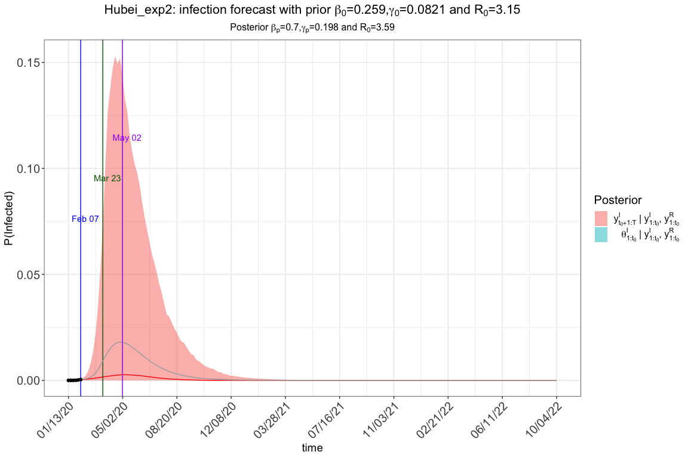<!-- -->

``` r
res.exp2$spaghetti_plot
```

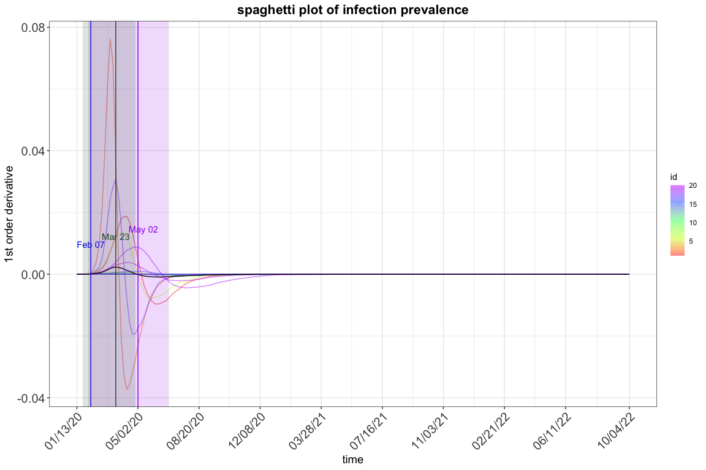<!-- -->

``` r

### without pi(t), the standard state-space SIR model without intervention
res.nopi <- tvt.eSIR(Y, 
                     R, 
                     begin_str = "01/13/2020", 
                     death_in_R = 0.4, 
                     T_fin = 200, 
                     casename = "Hubei_nopi",
                     save_files = F,
                     save_plot_data = F,
                     M=5e3,nburnin = 2e3)
#> The follow-up is from 01/13/20 to 07/30/20 and the last observed date is 02/11/20.
#> Running without pi(t)
#> Compiling model graph
#>    Resolving undeclared variables
#>    Allocating nodes
#> Graph information:
#>    Observed stochastic nodes: 60
#>    Unobserved stochastic nodes: 36
#>    Total graph size: 1875
#> 
#> Initializing model
res.nopi$plot_infection
```

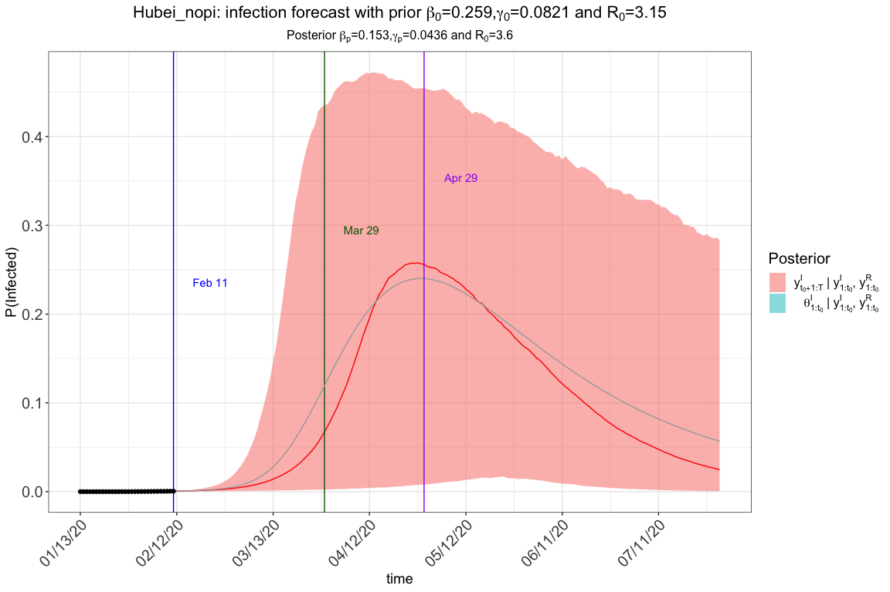<!-- -->

``` r
res.nopi$spaghetti_plot
```

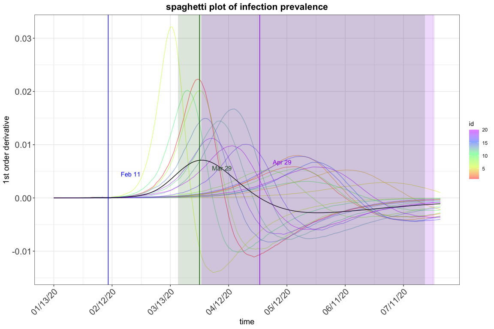<!-- -->

``` r
#res.nopi$plot_removed
```

## Model 2 using `qh.eSIR()`: SIR with time-varying quarantine, which follows a Dirac Delta function

By introducing a vector of `phi` and its corresponding changing points
`change_time`, we introduced a quarantine process that is dependent on a
dirac delta function \(\phi_t\in [0,1]\). In other words, only at time
points defined by `change_time`, we have certain porportions of the
at-risk (susceptible) subjects moved to the quarantine stage. The
difference of this model than the previous time-varying transmission one
is that we do not allow the tranmission rate to change, but only let the
proportion of susceptible subjects decrease. 


``` r
set.seed(20192020)
# Cumulative number of infected cases
NI_complete <- c( 
  41, 41, 41, 45, 62, 131, 200, 270, 375, 444,
  549, 729, 1052, 1423, 2714, 3554, 4903, 5806,
  7153, 9074, 11177, 13522, 16678, 19665, 22112,
  24953, 27100, 29631, 31728, 33366)
# Cumulative number of removed cases
RI_complete <- c(
  1, 1, 7, 10, 14, 20, 25, 31, 34, 45, 55, 
  71, 94, 121, 152, 213, 252, 345, 417, 561,
  650, 811, 1017, 1261, 1485, 1917, 2260,
  2725, 3284, 3754)
N <- 58.5e6
R <- RI_complete / N
Y <- NI_complete / N - R #Jan13->Feb 11

change_time <- c("01/23/2020", "02/04/2020", "02/08/2020")
phi0 <- c(0.1, 0.4, 0.4)
res.q <- qh.eSIR(Y, 
                 R, 
                 begin_str = "01/13/2020",
                 phi0 = phi0,
                 change_time = change_time,
                 casename = "Hubei_q", 
                 save_files = TRUE,
                 save_mcmc = FALSE,
                 save_plot_data = FALSE,
                 M = 5e3,
                 nburnin = 2e3)
#> The follow-up is from 01/13/20 to 07/30/20 and the last observed date is 02/11/20.
#> Running for qh.eSIR
#> Compiling model graph
#>    Resolving undeclared variables
#>    Allocating nodes
#> Graph information:
#>    Observed stochastic nodes: 60
#>    Unobserved stochastic nodes: 36
#>    Total graph size: 2736
#> 
#> Initializing model
res.q$plot_infection
```

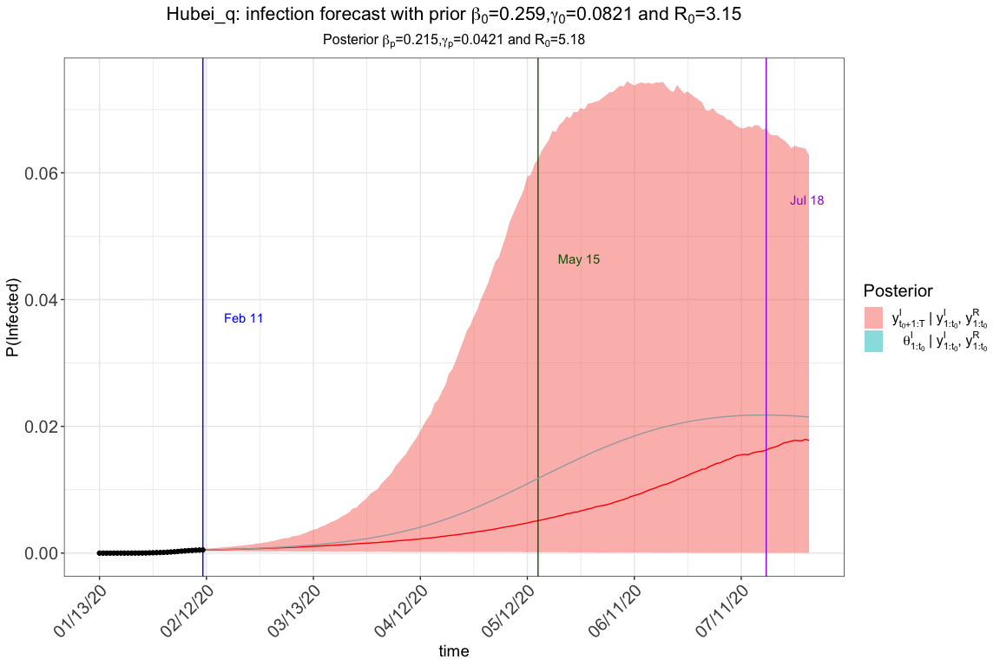<!-- -->

You will obtain the following plot in addition to the traceplots and
summary table if you set `save_file=T` in `qh.eSIR`. The blue vertical
line denotes the beginning date, and the other three gray lines denote
the three change points.

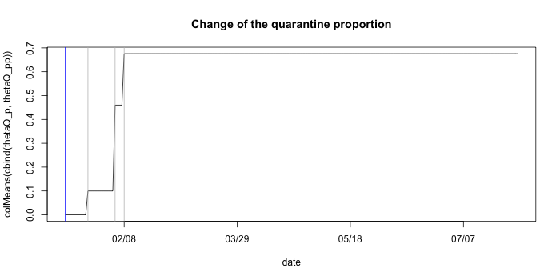

## Model 3 using `eSAIR`: SIR with time-varying subset of population immunized with antibody positivity

To address the under-reporting issue associated with the available
public databases and to build the self-immunization into the infection
dynamics, we then further extend the previous eSIR model to an eSAIR
model by adding an antibody (A) compartment. As is shown in the bottom
thread of the following figure, this A compartment accounts for the
probability of being self-immunized with antibodies to COVID-19, denoted
by \(\theta_t^A\); see equation as follows too, where \(\alpha(t)\) is a
function describing the proportion of people moving from the susceptible
compartment to the antibody compartment over time. Compartment A helps
circumvent limitations of data collection, especially embracing
individuals who were infected but self-cured at home with no
confirmation by viral RT-PCR diagnostic tests. This new eSAIR model
characterizes the underlying population-level dynamics of the pandemic.
The following system of ordinary differential equations defines
collectively the continuous-time dynamics for the eSAIR model, which
governs the law of movements among four compartments of Susceptible,
Self-immunized, Infected and Removed.

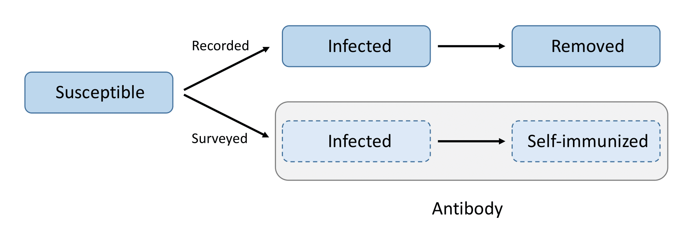


In the example below, we implemented this function onto New York state
data assuming that by April 29, 20% of the population have been
self-immunized with antibody positivity.

``` r
# Cumulative number of infected cases
NI_complete <- c( 
  1, 2, 11, 23, 31, 76, 106, 142, 150, 220, 327,
  421, 613, 615, 967, 1578, 3038, 5704, 8403,
  11727, 15800, 20884, 25681, 30841, 37877,
  44876, 52410, 59648, 66663, 75833, 83948,
  92506, 102987, 113833, 123160, 131815,
  139875, 151061, 161779, 172348, 181026,
  189033, 195749, 203020, 214454, 223691,
  230597, 237474, 243382, 248416, 253519,
  258222, 263460, 271590, 282143, 288045,
  291996, 295106, 299691, 304372, 308314)
# Cumulative number of removed cases
RI_complete <- c(
  0, 0, 0, 0, 0, 0, 0, 0, 0, 0, 1, 2, 
  20, 26, 38, 52, 200, 311, 468, 662,
  893, 1144, 1547, 2144, 2931, 3900, 
  5133, 6201, 7657, 9483, 11536,
  13915, 16276, 18781, 21110, 23424,
  26469, 29784, 32899, 35785, 37730,
  39207, 40703, 42164, 43488, 44723, 
  45887, 47473, 47686, 48769, 49572,
  50221, 52161, 52917, 54115, 54613,
  55473, 55816, 56809, 57265, 58525)
N <- 8.399e6
R <- RI_complete / N
Y <- NI_complete / N - R 

change_time <- c("04/29/2020")
alpha0 <- c(0.2) # 20% of the susceptible population were found immunized
res.antibody <- eSAIR(Y,
                      R, 
                      begin_str = "03/01/2020",
                      alpha0 = alpha0, 
                      change_time = change_time,
                      casename = "New_York_antibody", 
                      save_files = F, 
                      save_mcmc = F, 
                      M=5e2, 
                      nburnin = 2e2)
#> The follow-up is from 03/01/20 to 09/16/20 and the last observed date is 04/30/20.
#> Running for eSAIR
#> Compiling model graph
#>    Resolving undeclared variables
#>    Allocating nodes
#> Graph information:
#>    Observed stochastic nodes: 122
#>    Unobserved stochastic nodes: 67
#>    Total graph size: 5123
#> 
#> Initializing model
#> 
#> NOTE: Stopping adaptation
res.antibody$plot_infection
```

<!-- -->

## Outputs and summary table

To save all the plots (including trace plots) and summary tables, please
set `save_files=T`, and if possible, provide a location by setting
`file_add="YOUR/FAVORITE/FOLDER"`. Otherwise, the traceplots and other
intermediate plots will not be saved, but you can still retrieve the
forecast plots and summary table based on the return list, e.g., using
`res.step$forecast_infection` and `res.step$out_table`. Moreover, if you
are interested in plotting the figures on your own, you may set
`save_mcmc=T` so that all the MCMC draws will be saved in a `.RData`
file too.

For details, please explore our package directly. We have `.rd` files
established, please use `help(tvt.eSIR)` or `?qh.eSIR` to find them.

## Acknowledgements

This package is created and maintained by [Lili
Wang](https://github.com/lilywang1988), contributed by [Fei
Wang](https://github.com/feiwsteven), [Lu
Tang](https://github.com/ClumsyBear), and [Paul
Egeler](https://github.com/pegeler). We also thank [Kangping
Yang](https://github.com/kangpingy) for helping us collect the recovery data from
the web page.

## References

1. Wang, L., Zhou, Y., He, J., Zhu, B., Wang, F., Tang, L., ... & Song, P. X. (2020). An epidemiological forecast model and software assessing interventions on the COVID-19 epidemic in China. Journal of Data Science, 18(3), 409-432. [link](https://www.airitilibrary.com/Publication/alDetailedMesh?DocID=16838602-202007-202008240002-202008240002-409-432&sourceBrowseType=0)

2. Osthus, D., Hickmann, K. S., Caragea, P. C., Higdon, D., & Del Valle, S. Y. (2017). Forecasting seasonal influenza with a state-space SIR model. The annals of applied statistics, 11(1), 202.

3. Gelman, A., & Rubin, D. B. (1992). Inference from iterative simulation using multiple sequences. Statistical science, 7(4), 457-472.

-----

Shield: [](https://creativecommons.org/licenses/by/4.0/)

This work is licensed under a [Creative Commons Attribution 4.0
International License](https://creativecommons.org/licenses/by/4.0/).

[](https://creativecommons.org/licenses/by/4.0/)
